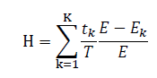
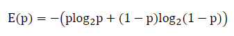
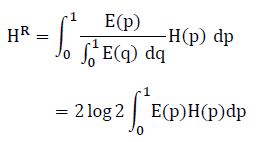

# Reardon's Segregation Index for Continuous Variables

* Many kinds of segregation index are used for various purposes for policies and studies. While there are wide ranges of varibles to meausre an amount of segregtaion like race group, continuous values like income requires some more steps.

* [Reardon(2011)](https://cepa.stanford.edu/sites/default/files/reardon%20&%20bischoff%20income%20inequality%20segregation%20AJS%20final.pdf), [Reardon and Bischoff(2011)](https://cepa.stanford.edu/sites/default/files/reardon%20&%20bischoff%20income%20inequality%20segregation%20AJS%20final.pdf) propsed a rank-order segregation index based on Theil index of Entropy. This index is widely accepted for practical and academic uses including [Chetty et al. 2014](https://www.nber.org/system/files/working_papers/w19843/w19843.pdf).

* The proposed method to calculate the index is a bit intricate and there seems to be no good online library or code that implement the calculation. Therefore, here is one. Python codes inside ```src/segregation_index.py``` implements Rank-Order Information Theory Index of Reardon(2011).

* Essentials of the Index

  * The inequality index *H* is an average of each value from a total of K sectors, which is total region's entropy(*E*) minus each sector's entropy(*E_K*). It is weighted by each sector's relative popultaion size(*t_k/T*). Here the entropy stands for how equally variables(ex. income) are distributed over sectors.

    
  
  * Below is an equation to calculate entropy when there is two groups. *p* is a ratio of a group. As the variable here is continuous not categorical, one needs to integrate the below equation over *p* with a range of 0≤p≤1. Thus transformation of raw values into rank ordered values is required.
  
    

  * Combining above equations, we can calculate below one to get a Rank-Order Information Theory Index, which is the segregation index for continuous variables. 0 means perfect equality. 1 means perfect segregation.
  
    


  <br/>
* **Test**
  ```
  from src.segregation_index import estimate_Hp

  # Say, each variables are income.
  # Each inner list stands for a sector.
  areas1 = [[80, 80, 70, 70], [50, 45, 40],[20, 20, 20, 10]]
  areas2 = [[80, 70, 50], [80, 70, 45, 20, 20], [40, 20, 10]]

  print(estimate_Hp(areas1))
  print(estimate_Hp(areas2))

  >> 0.7182    
  >> 0.3191
  # areas1 is more income-way segregated than areas2.
  ```